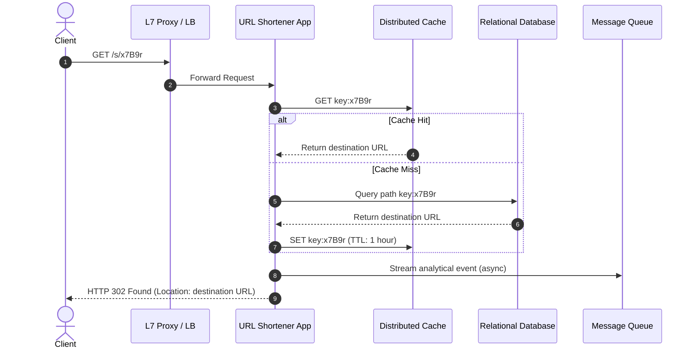
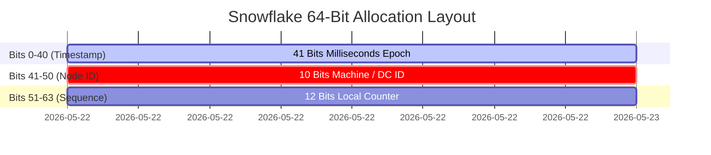

# 🔬 Lab 09: System Design URL Shortener (Syllabus Capstone)

In this final capstone laboratory, you will assemble a complete, production-grade **System Design URL Shortener** in TypeScript. You will build a custom **Base62 Encoder** to generate compact path keys, design a high-throughput **URL Redirection Server** that integrates **Caching** to reduce database read pressure, and implement an asynchronous **Analytics Dispatcher** that streams page-view metrics to a **Message Queue** for offline analysis.

---

## 1. 💡 The Core Concepts

A **URL Shortener** (e.g., bit.ly, tinyurl.com) takes a long destination URL and compresses it into a short, unique link. When a client visits the short link, the server quickly resolves it to the destination URL and performs an HTTP redirect.

---

## 2. 🪐 Detailed Mathematical Models & Sizing

### The Base62 Encoding System

How do we convert database numeric primary keys (like `ID = 104729`) into compact, human-readable path suffixes?
- We use the **Base62** character set, consisting of 62 alphanumeric characters:
  `0123456789abcdefghijklmnopqrstuvwxyzABCDEFGHIJKLMNOPQRSTUVWXYZ`
- **Why Base62?** Unlike Base64, Base62 does not use `+` or `/` characters, which have special meanings in URL paths and query strings. It is completely safe to embed directly into paths without URL encoding.

#### Mathematical Conversion Formula

To encode a 64-bit integer $X$ to Base62:
$$X_0 = X$$
$$\text{Remainder } r_i = X_i \pmod{62}$$
$$X_{i+1} = \lfloor \frac{X_i}{62} \rfloor$$
This is repeated until $X_{i+1} = 0$. The resulting Base62 string represents the characters at index positions $r_k, r_{k-1}, \ldots, r_0$.

To decode a Base62 string $S = s_n s_{n-1} \ldots s_0$ back to an integer:
$$\text{Value}(S) = \sum_{j=0}^{n} \text{charset.indexOf}(s_j) \times 62^j$$

#### Worked Example:
Encode $123456789$:
1. $123456789 \pmod{62} = 3 \implies \text{charset}[3] = '3'$
2. $\lfloor \frac{123456789}{62} \rfloor = 1991238 \pmod{62} = 4 \implies \text{charset}[4] = '4'$
3. $\lfloor \frac{1991238}{62} \rfloor = 32116 \pmod{62} = 60 \implies \text{charset}[60] = 'Y'$
4. $\lfloor \frac{32116}{62} \rfloor = 517 \pmod{62} = 21 \implies \text{charset}[21] = 'l'$
5. $\lfloor \frac{517}{62} \rfloor = 8 \pmod{62} = 8 \implies \text{charset}[8] = '8'$
6. $\lfloor \frac{8}{62} \rfloor = 0 \implies \text{Stop}$.
   - Result: `"8lY43"`

---

### Suffix Sizing Capacity Table

The number of unique combinations possible increases exponentially with key length $L$:
$$\text{Capacity}(L) = 62^L$$

| Key Length ($L$) | Math Expression | Total Unique Keys | Recommended Scale |
|---|---|---|---|
| **1** | $62^1$ | $62$ | Sandbox |
| **3** | $62^3$ | $238,328$ | Dev Test |
| **5** | $62^5$ | $\approx 916,132,832$ | Regional Startup |
| **7** | $62^7$ | $\approx 3,521,614,606,208$ | global Enterprise |

---

### System Scaling Estimations & Storage Sizing

Assuming a high-throughput startup receives **100 shorten writes/sec** and **10,000 redirection reads/sec**:

#### 1. Daily DB Storage Sizing Formula
$$\text{Daily Storage} = N_{\text{writes}} \times \text{SecondsInDay} \times \text{SizePerRecord}$$
If each DB record (ID + original URL + metadata) averages $500\text{ bytes}$:
$$\text{Daily Storage} = 100 \times 86,400 \times 500\text{ bytes} \approx 4.32\text{ GB per day}$$
$$\text{Yearly Storage} \approx 1.57\text{ TB per year}$$

#### 2. Memory Size for Redis Caching (80-20 Rule)
If we cache 20% of the active daily reads for 1 day:
$$\text{Cached URL Keys} = 10,000 \times 86,400 \times 0.20 = 172.8\text{ million items}$$
At $100\text{ bytes}$ per key-value cache entry:
$$\text{RAM Needed} = 172.8\text{ million} \times 100\text{ bytes} \approx 17.28\text{ GB of RAM}$$

---

## 3. ⚙️ Advanced System Design Add-Ons

### Distributed ID Allocation (Snowflake IDs)
If we have 10 web servers generating new short URLs, how do we guarantee they don't generate the same numeric ID without a central database lock?
- **Twitter Snowflake**: Generates a 64-bit unique integer structured as:
  - `1-bit` unused sign bit.
  - `41-bits` timestamp in milliseconds (gives 69 years of capacity).
  - `10-bits` machine ID / datacenter ID (allows up to 1024 unique server nodes).
  - `12-bits` sequence number (local counter incrementing up to 4096 within the same millisecond).
  - This allows servers to generate unique, chronologically ordered, 64-bit IDs fully concurrently without any inter-process communication!

---

## 🚫 Common Pitfalls & Anti-Patterns

### 1. The Integer Overflow Pitfall
Using JavaScript standard `Number` objects representing 64-bit integers. Standard JavaScript `Number` relies on double-precision floats, limiting exact integer safety to:
$$\text{Number.MAX\_SAFE\_INTEGER} = 2^{53} - 1 \approx 9 \times 10^{15}$$
- **Modern Solution**: Use JavaScript `BigInt` or raw string byte manipulation when representing Snowflake/64-bit databases to prevent bit truncation and precision loss.

### 2. Cache Stampede (Dogpile Effect)
When a highly active URL's cache key expires, thousands of concurrent requests read-miss simultaneously, firing duplicate heavy SQL select statements to the relational database at the same instant.
- **Modern Solution**: Implement locking with single-flight wrappers or active background cache TTL refresh rules.

### 3. Infinite Redirect Loops
If a user submits the shortened link as the target URL itself (e.g. shortening `https://yourdomain.com/s/xyz` back to `https://yourdomain.com/s/xyz`), resolving the key triggers an infinite stack call.
- **Modern Solution**: Sanitize input. Blacklist your own domain namespace from the destination URL inputs.

---

## 🎯 Key Takeaways

1. **Base62 conversions** offer the optimal URL character set encoding, preventing standard URL path escaping issues and expanding combinations exponentially.
2. **302 Found** redirects must be selected to bypass browser caching and preserve analytical metrics pipelines.
3. **Cache-Aside architectures** coupled with **Asynchronous Write MQ Pipelines** represent standard industry patterns to segregate read and write contention at massive globally distributed scales.
